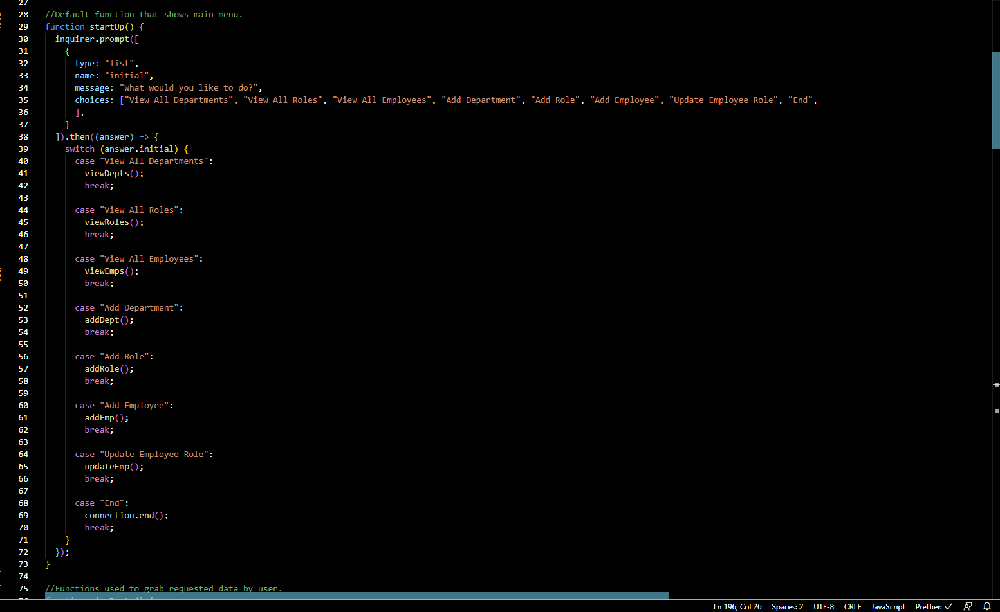
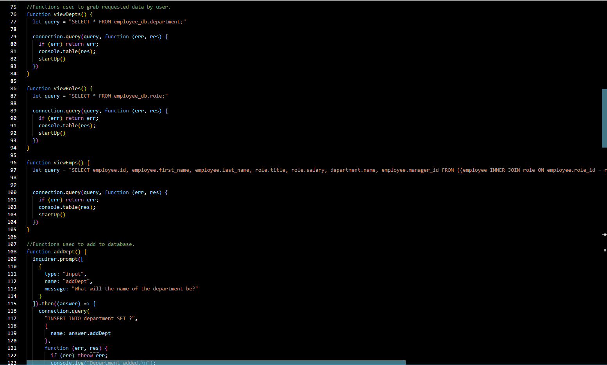

# Employee Tracker

## Description

This is a CLI app that will let you make a database of your employees.

## Installation

Install all node dependencies using npm i.

## Usage

Use node app.js to start the app. The user is then presented with a menu of options. The user may do anything from viewing data from the database to creating data to add to the database.

## License

This project uses the MIT_License license.

## Contributers

Node, Java, MySQL, Express, Inquirer, Visual Studio Code

## Images

## Video

https://youtu.be/kXfbBn-G7lk

## Questions

If you have any questions or suggestions, please contact me here:
[oscar.oses.1127@gmail.com](oscar.oses.1127@gmail.com)
